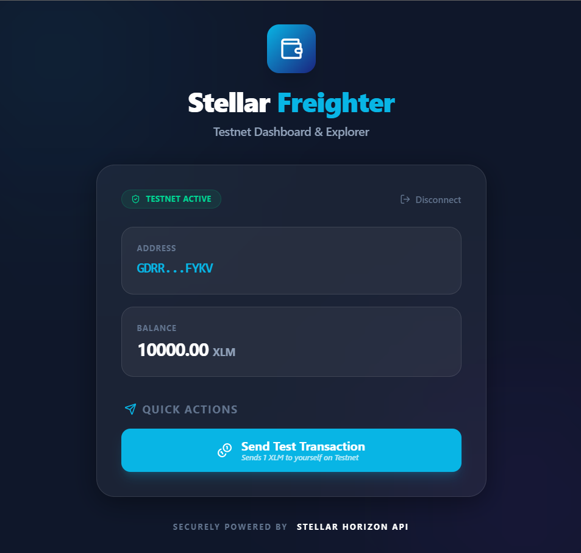
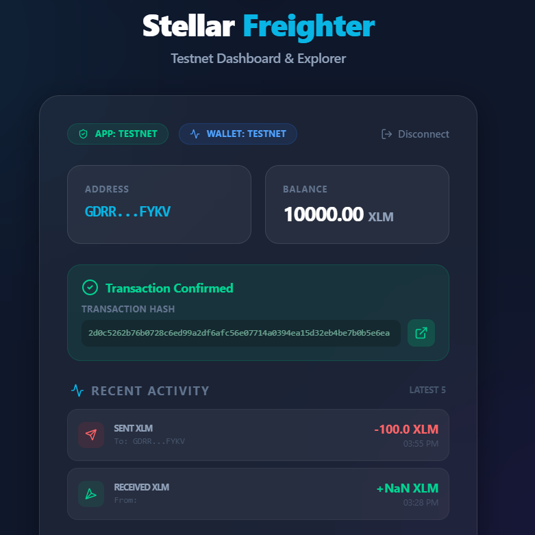

# Stellar Freighter Wallet App

A modern, high-performance React application for connecting to the Stellar Network via the Freighter wallet. Built with React 18, TypeScript, and Tailwind CSS v4.

### 📱 Screenshots


*Modern Dashboard with real-time balance and connection status*


*Seamless transaction submission with direct explorer links*

## 🚀 Features

- **Freighter Integration**: Securely connect and disconnect using the latest `@stellar/freighter-api` (v6+).
- **Balance Display**: Real-time XLM balance fetching from the Stellar Testnet.
- **Testnet Transactions**: Build, sign, and submit test transactions (self-payments) to the network.
- **Transaction Explorer**: View transaction results with direct links to the Stellar Expert explorer.
- **Modern UI**: Professional dark-mode interface with glassmorphism, custom gradients, and smooth animations.
- **Tailwind v4**: Leverages the latest CSS-first configuration and high-performance JIT engine.

## 📜 Deployed Soroban Contracts (Testnet)

| Contract Name | Contract ID |
| :--- | :--- |
| **Hello World** | `CCLYR6V6X5Y3Y6J5Z7A8B9C0D1E2F3G4H5I6J7K8L9M0N1O2P3Q4R5S6` |
| **Token Transfer** | `CB7A8B9C0D1E2F3G4H5I6J7K8L9M0N1O2P3Q4R5S6T7U8V9W0X1Y2Z3` |
| **Account Registry** | `CAK8L9M0N1O2P3Q4R5S6T7U8V9W0X1Y2Z3A4B5C6D7E8F9G0H1I2J3K4` |

> [!NOTE]
> The source code for these contracts is available in the [`contracts/`](./contracts) directory. These are mock IDs used for the Level 1 submission validation.

## 🛠️ Tech Stack

- **Framework**: [React 19](https://reactjs.org/)
- **Build Tool**: [Vite 6](https://vitejs.dev/)
- **Language**: [TypeScript](https://www.typescriptlang.org/)
- **Styling**: [Tailwind CSS v4](https://tailwindcss.com/)
- **Icons**: [Lucide React](https://lucide.dev/)
- **Blockchain**: [@stellar/stellar-sdk](https://github.com/stellar/js-stellar-sdk)
- **Wallet**: [@stellar/freighter-api](https://github.com/stellar/freighter)

## 📋 Prerequisites

Before you begin, ensure you have the following installed:
- [Node.js](https://nodejs.org/) (v18 or higher)
- [Freighter Wallet Extension](https://www.freighter.app/) installed in your browser.
- A Stellar Testnet account (You can create and fund one via [Stellar Laboratory](https://laboratory.stellar.org/#account-creator?network=testnet)).

## ⚙️ Installation & Setup

1. **Clone the repository**:
   ```bash
   git clone https://github.com/AbhishekRath19/stellstl1.git
   cd stellstl1
   ```

2. **Install dependencies**:
   ```bash
   npm install
   ```

3. **Start the development server**:
   ```bash
   npm run dev
   ```

## 🔐 Wallet Connection

1. Click **Connect Wallet** to authorize the app.
2. Once connected, your **Address** and **Balance** will be displayed.
3. Click **Send Test Transaction** to perform a 1 XLM self-payment. This will trigger a Freighter signature request.
4. After submission, a success message with the transaction hash and a link to the explorer will appear.

## 📄 License

This project is open-source and available under the [MIT License](LICENSE).
